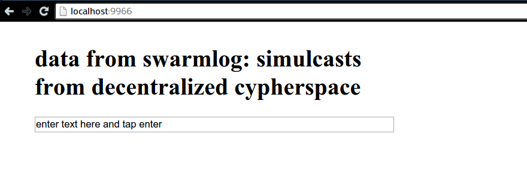

# hyperplate

boilerplate for swarmlog-connected webapps

## what

basically just a cobbled-together mush of
[substack](https://github.com/substack)'s views (as received) on life, the
internet, and everything, in code form. let's all be **hyper**minimalist
hackertrons.

no but seriously, i needed to find a calm place with web frontend technology and
decentralization. this is that place.

### run it

2. `npm install -g signalhub`
3. `signalhub listen -p 8080`
4. start another terminal sesh
1. `npm start` (also inits a keypair)
2. start another terminal sesh
3. `npm run serve-broadcaster`

#### shipping with hyperboot

checkout the "bootable" branch to see how it
works. [substack](https://www.github.com/substack/) is changing hyperboot pretty
quickly, but you can ship a bundled webapp with the current version like so:

1. `cd src`
2. `browserify -d index.js > bundle.js`
3. bump the `<meta>` version tag in index.html
2. `html-inline index.html > app.html`
3. modify the bundled copy of the GSS engine as detailed in
   [gss#206](https://github.com/gss/engine/issues/206) so your browser can parse
   it
3. `hyperboot commit app.html`
4. serve the `./hyperboot` directory: `ecstatic --cors -p 8000 .hyperboot`

a working example is in the `bootable` branch, under the `./hyperboot`
directory. you can also pull the bundled app from
[this gist](https://gist.github.com/du5t/580663be3574e0bf8d9d) and test with
hyperboot alone.

### bits

- UI
  - [main-loop](https://github.com/Raynos/main-loop): fast app state updater
  - [virtual-dom](https://github.com/Matt-Esch/virtual-dom): virtual DOM without
    extra junk
  - [virtual-hyperscript](https://github.com/Matt-Esch/virtual-dom/tree/master/virtual-hyperscript):
    because HTML is tiring/tired
  - [GSS](http://gridstylesheets.org/guides/ccss/): constraint-based styling
- Data
  - [level-browserify](https://github.com/Level/level-browserify): bundled
    levelup and leveldown
  - [subleveldown](https://github.com/mafintosh/subleveldown): 'namespaced'
    sub-levels
  - [hyperkv](https://github.com/substack/hyperkv): p2p key-value store that
    wraps around a hyperlog
  - [swarmlog](https://github.com/substack/swarmlog): p2p webrtc-based hyperlog
  - [memdb](https://github.com/rain1017/memdb): easy to use in-memory DB for
    testing
- Crypto
  - [chloride](https://github.com/paixaop/node-sodium): NaCl for browser
  - [ssb-keys](https://github.com/ssbc/ssb-keys): for generating ec25519
    keypairs
- Shippin
  - [html-inline](https://github.com/substack/html-inline): bundles HTML `src`
    directives into inline content
  - [hyperboot](https://github.com/substack/hyperboot): versioned webapp
    bootloader with offline storage

i'm not planning on adding a router, but if you need a minimal one,
[something trie-based](https://github.com/zensh/route-trie) might be cool.

## TODO

- [x] hook up hyperkv
- [x] stub controls
 - [x] input+put
- [ ] add stream multiplexing (multiplexing!) w/ dataplex
- [x] add simple gss styling
- [x] build hyperbooted version
